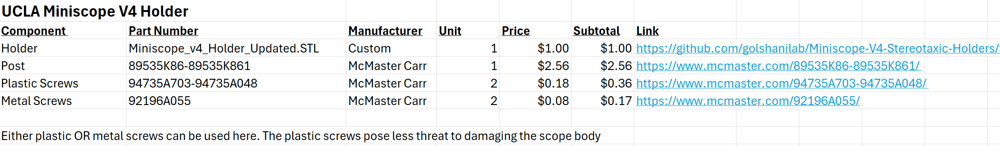

# Miniscope V4 Stereotaxic Holders
Surgical devices for reliable microscope and GRIN lens placement. 

The first component is the UCLA Miniscope V4 Holder, detailed below:  

1. Miniscope_v4_Holder.STL (Custom 3D Printed Part, .STL found [here](https://github.com/golshanilab/Miniscope-V4-Stereotaxic-Holders/tree/main/STL%20File%20For%203D%20Printing))
2. Multipurpose 304/304L Stainless Steel Rod, 5/16" Diameter, 1/2 Feet Long. McMaster Number: 89535K86-89535K861 [Link](https://www.mcmaster.com/89535K86-89535K861/)
3. Tapered Heat-Set Inserts for Plastic, 0-80 Thread Size, 0.115" Installed Length, Brass. McMaster Number: 93365A102 [Link](https://www.mcmaster.com/93365A102/)
4. 18-8 Stainless Steel Socket Head Screw, 0-80 Thread Size, 1/4" Long. McMaster Number: 92196A055 [Link](https://www.mcmaster.com/92196A055/)
5. Nylon Pan Head Screws Phillips, 0-80 Thread, 1/4" Long McMaster Number: 94735A703-94735A048 [Link](https://www.mcmaster.com/94735A703-94735A048/)

*Please Note* you only need one tyoe of screw, either the Nylon (line item #5) or the Stainless Steel (Line item #4). The decision is up to you, but the plastic screws seem to protect the miniscope housing quite well to minimize damage due to overtightening. Additionally, please ensure you have a suitable small screwdriver for either screw option! 

A table view of the parts and costs can be seen below:
 

And mechanical drawing of how the assembly looks can be seen here:
 
 

The next component is a GRIN lens holder that can be mounted to standard stereotaxic equipment. Please note that the tolerances are very tight for this component and it is critical to print this part using a high-performance SLA-based 3D printer like the Formlabs Form 3 or equivalent. Please print in the vertical orientation so as to maintain the integrity of the vacuum channel. 

And mechanical drawing of how the component looks can be seen here:  
 
 
