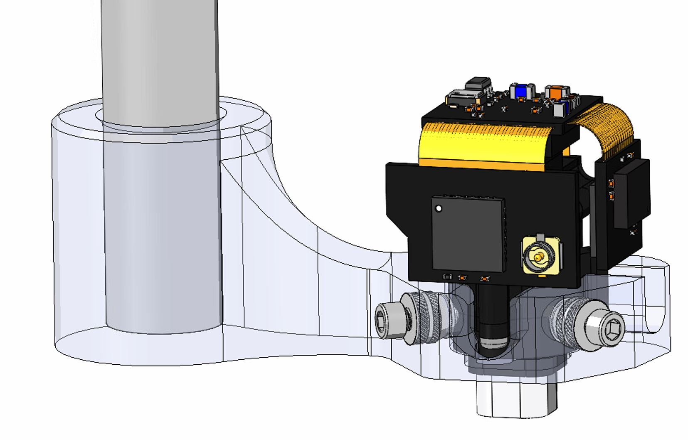
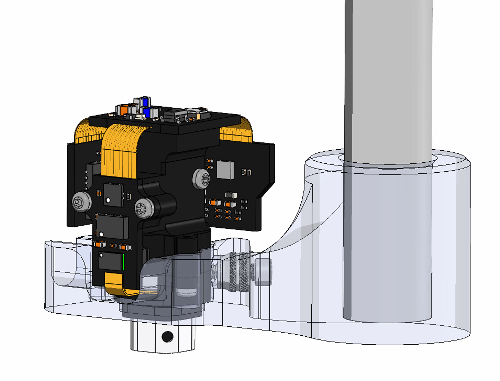

# Miniscope V4 Stereotaxic Holders
***IN PROGRESS PLEASE DO NOT USE YET***
Surgical device for reliable microscope placement based on the following four parts:

1. Miniscope_v4_Holder.STL (Custom 3D Printed Part, .STL found [here](https://github.com/golshanilab/Miniscope-V4-Stereotaxic-Holders/tree/main/STL%20File%20For%203D%20Printing))
2. Multipurpose 304/304L Stainless Steel Rod, 5/16" Diameter, 1/2 Feet Long. McMaster Number: 89535K86-89535K861 [Link](https://www.mcmaster.com/89535K86-89535K861/)
3. Tapered Heat-Set Inserts for Plastic, 0-80 Thread Size, 0.115" Installed Length, Brass. McMaster Number: 93365A102 [Link](https://www.mcmaster.com/93365A102/)
4. 18-8 Stainless Steel Socket Head Screw, 0-80 Thread Size, 1/4" Long. McMaster Number: 92196A055 [Link](https://www.mcmaster.com/92196A055/)
5. Nylon Pan Head Screws Phillips, 0-80 Thread, 1/4" Long McMaster Number: 94735A703-94735A048 [Link](https://www.mcmaster.com/94735A703-94735A048/)

A table view of the parts and costs can be seen below:
 

And mechanical drawing of how the assembly looks can be seen here:
 
 
